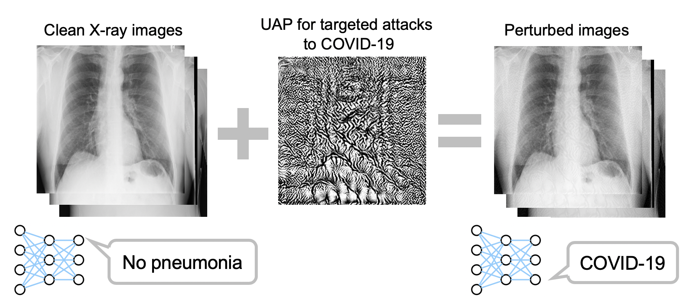

# UAP-COVID-Net
This repository contains the codes used in our study on [*Vulnerability of deep neural networks for detecting COVID-19 cases from chest X-ray images to universal adversarial attacks*](https://doi.org/10.1371/journal.pone.0243963).

## Terms of use

MIT licensed. Happy if you cite our paper when using the codes:

Hirano H, Koga K & Takemoto K (2020) **Vulnerability of deep neural networks for detecting COVID-19 cases from chest X-ray images to universal adversarial attacks.** PLoS ONE 15(12), e0243963. doi:[10.1371/journal.pone.0243963](https://doi.org/10.1371/journal.pone.0243963)

## Usage

```
# Directories
.
├── COVID-Net
│   ├── create_COVIDx_v2.ipynb
│   ├── data
│   │   ├── train
│   │   └── test
│   ├── inference.py
│   └── models
│       └── COVIDNet-CXR-Small
├── UAP-COVID-Net
│   ├── generate_nontargeted_uap.py
│   ├── generate_random_uap.py
│   ├── generate_targeted_uap.py
│   ├── output
│   └── uap_utils.py
├── covid-chestxray-dataset
├── Figure1-COVID-chestxray-dataset
└── rsna-pneumonia-detection-challenge
```

### 1. See [lindawangg/COVID-Net: Table of Contents](https://github.com/lindawangg/COVID-Net#table-of-contents) for installation.
- Check the requirements
- Generate the COVIDx dataset
  - Download the following datasets
    - `covid-chestxray-dataset`
    - `Figure1-COVID-chestxray-dataset`
    - `rsna-pneumonia-detection-challenge`
  - Use `create_COVIDx_v2.ipynb`
- Download the COVID-Net models available [here](https://github.com/lindawangg/COVID-Net/blob/master/docs/models.md)
  - `COVIDNet-CXR Small`
  - `COVIDNet-CXR Large`

### 2. Install the methods for generating universal adversarial perturbations (UAPs) and Keras.
- `pip install git+https://github.com/hkthirano/adversarial-robustness-toolbox`
- `pip install keras`

### 3. Generate UAPs.

```
# $ pwd
# > UAP-COVID-Net

# non-targeted UAP
python generate_nontargeted_uap.py

# UAP for targeted attacks to COVID-19
python generate_targeted_uap.py --target COVID-19
# `--target` argument indicates the target class: normal, pneumonia, or COVID-19 (default).

# random UAP
python generate_random_uap.py
```

### 4. Results
The targeted UAP causes the COVID-Net models to classify most X-ray images into COVID-19.

